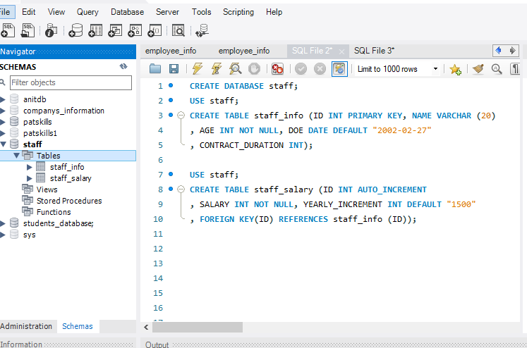
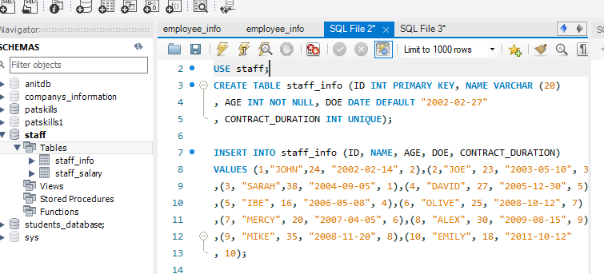
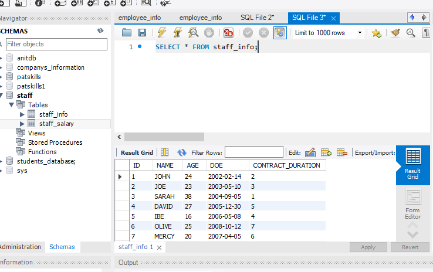
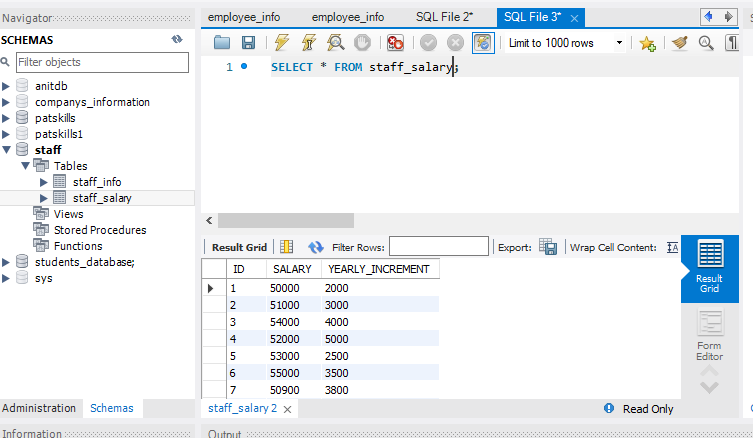

# SQL-TASK1
## INTRODUCTION
## I created a database in order to successfully complete my task on SQL
## PROBLEM STATEMENTS
- Create a database named STAFF
- Create two different tables named STAFF_INFO and STAFF_SALARY

  which should include (ID,NAME,AGE,DOE,CONTRACT_DURATION) and (ID,SALARY,YEARLY_INCREMENT) respectively
- Use 4 different CONSTRAINTS including PRIMARY_KEY and FOREIGN_KEY on both table

- Create 10 rows of information into both STAFF_INFO and STAFF_SALARY table

  

- Return just the ID and SALARY of staffs from STAFF_salary table

.PNG)

- Return just the NAME and AGE of Staffs from STAFF_INFO table

  .PNG)
